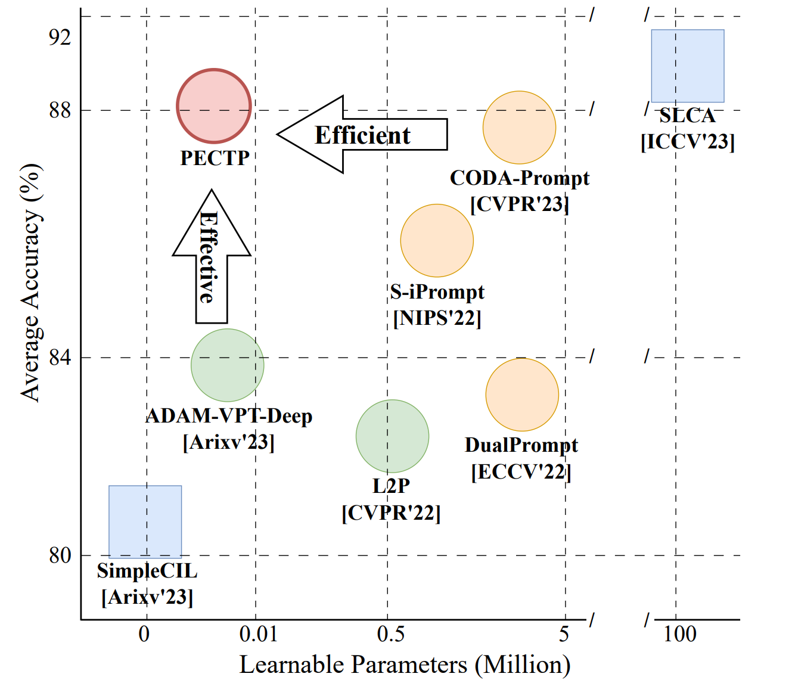
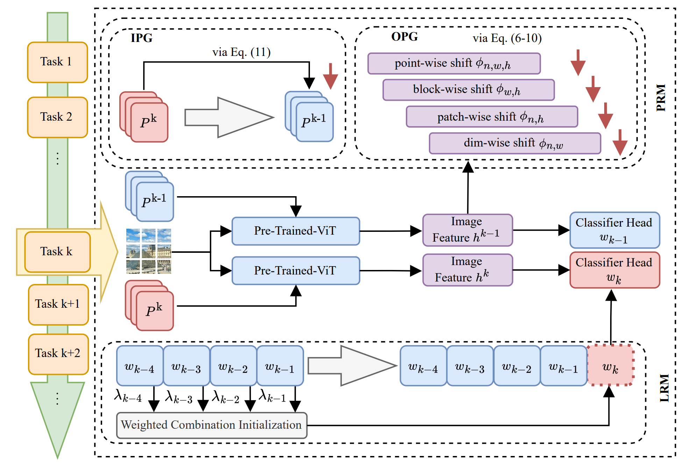
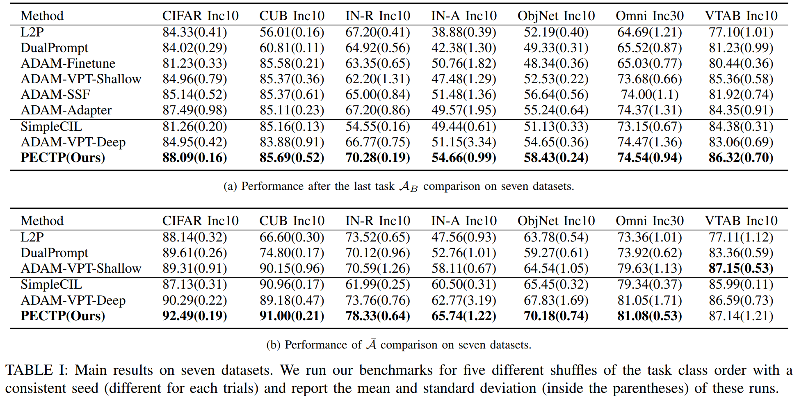

# TCSVT2025: PECTP: Parameter-Efficient Cross-Task Prompts for Incremental Vision Transformer


## Introduction
  Class-Incremental Learning (CIL) aims to learn deep models on sequential tasks continually, where each new task includes a batch of new classes and deep models do not have access to task-ID information at the inference time. Recent vast pre-trained models (PTMs) have achieved outstanding performance by prompt technique in practical CL without the old samples (rehearsal-free) and with a memory constraint (memory-constrained): Prompt-extending and Prompt-fixed methods. However, prompt-extending methods need a large memory buffer to maintain an ever-expanding prompt pool and meet an extra challenging prompt selection problem. Prompt-fixed methods only learn a single set of prompts on one of the incremental tasks and can not handle all the incremental tasks effectively. To achieve a good balance between the memory cost and the performance on all the tasks, we propose a Parameter-Efficient Cross-Task Prompt (PECTP) framework with Prompt Retention module (PRM) and classifier head Retention module (LRM). To make the final learned prompts effective on all incremental tasks, PRM constrains the evolution of cross-task prompts' parameters from Outer Prompt Granularity and Inner Prompt Granularity. Besides, we employ LRM to inherit old knowledge in the last classifier head to facilitate the cross-tasks prompts' generalization ability. Extensive experiments show the effectiveness of our method. 

## Trade-off between performance and overhead.



## Methods

## Results



## Requirements
### Environment
1. [torch 1.11.0](https://github.com/pytorch/pytorch)
2. [torchvision 0.12.0](https://github.com/pytorch/vision)
3. [timm 0.6.12](https://github.com/huggingface/pytorch-image-models)
4. cuda 10.2 and cudnn 8.33


You need to modify the path of the datasets in `./utils/data.py`  according to your own path.

## Running scripts
``bash train_all.sh``

## Acknolegment

The implentation of Prompt-based continual learning is based on [PyCIL](https://github.com/G-U-N/PyCIL) and [ADAM](https://github.com/zhoudw-zdw/RevisitingCIL).

Many thanks to its contributors!

## Citation

If you find our work helpful for your research, please consider citing our work.

```
@article{feng2024pectp,
  title={PECTP: Parameter-Efficient Cross-Task Prompts for Incremental Vision Transformer},
  author={Feng, Qian and Zhao, Hanbin and Zhang, Chao and Dong, Jiahua and Ding, Henghui and Jiang, Yu-Gang and Qian, Hui},
  journal={arXiv preprint arXiv:2407.03813},
  year={2024}
}
```

